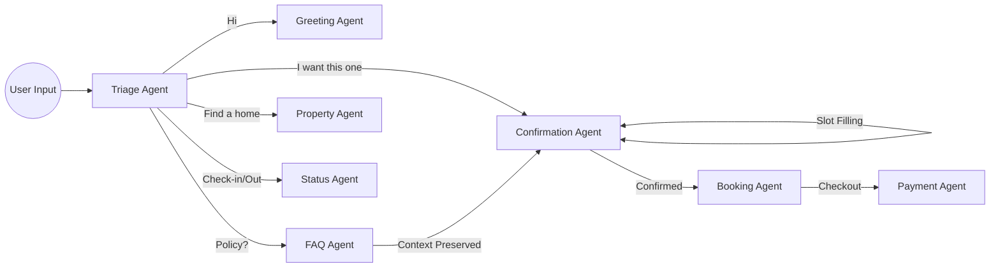

# AI Property Booking Concierge

[](https://www.python.org/)
[](https://www.rust-lang.org/)
[](https://fastapi.tiangolo.com/)
[](https://python.langchain.com/docs/langgraph)
[](https://supabase.com/)
[](https://openai.com/)
[](https://github.com/tokio-rs/axum)

A conversational AI platform for property bookings that combines a Python-based LangGraph orchestration layer with a high-performance Rust database gateway. The system handles natural language property searches, booking flows, FAQ handling, and payment processing through a multi-agent architecture.

## Hybrid Architecture

The system is split into two cooperating layers:

**Python AI Orchestration Layer** — Handles conversational state, intent classification, and agent routing using LangGraph. Each conversation flows through a state machine with specialized agents (greeting, property search, booking, FAQ, etc.) that operate on a shared `ChatState` object. The intent routing system uses a hybrid approach: lightweight pattern matching with [spaCy](https://spacy.io/) for common cases, falling back to OpenAI structured output when confidence is low.

**Rust Database Gateway** — A high-throughput microservice built on [Tokio](https://tokio.rs/) and [Axum](https://docs.rs/axum/latest/axum/) that manages database connections, caching, and tool execution. It exposes a schema-agnostic `/execute` endpoint that accepts [TOON](https://github.com/toon-lang/spec) (a compact binary serialization format) or JSON, routes to the appropriate tool, and caches results with TTL-based eviction. The gateway handles property search, booking validation, pricing, sentiment analysis, and fraud detection.

The Rust gateway sits behind the Python orchestration layer but can operate independently for high-throughput scenarios. Communication happens over HTTP with the Python layer consuming the Rust gateway as a service.

## System Architecture


## Agent Workflow (LangGraph)

The agentic framework uses a robust state machine to preserve context. If a user asks an FAQ question in the middle of a booking, the system safely routes them to the FAQ agent and seamlessly brings them back to complete their booking.



## Interesting Techniques

**LLM State Routing with Confidence Thresholds** — Intent classification in [`agents.py`](backend/app/services/agents.py) uses a tiered approach: deterministic pattern matching → NLP-based extraction → LLM structured output with confidence scoring. The [`triage_intent()`](backend/app/services/agents.py:413) function evaluates multiple "shield" conditions to preserve conversation context when users interject with greetings or questions mid-flow.

**Async Connection Pooling** — The Rust gateway uses Tokio's async runtime with shared-state concurrency. Database connections and the tool registry are wrapped in `Arc<AppState>` for lock-free read access across request handlers. See the [Axum State pattern](https://docs.rs/axum/latest/axum/extract/struct.State.html).

**Conversational UI State Management** — The [LangGraph](https://langchain-ai.github.io/langgraph/) state machine tracks user context across nodes: `triage` → `property` → `confirmation` → `booking` → `payment`. The [`ChatState`](backend/app/services/graph.py:23) TypedDict persists filters, booking args, and payment state across turns. The graph uses conditional edges to route between nodes based on detected intent and tool results.

**Streaming LLM Responses** — The [`llm_reply_from_results()`](backend/app/services/agents.py:555) function supports Server-Sent Events streaming with token-level callbacks, allowing real-time response generation without blocking the event loop.

**Hybrid RAG Pipeline** — Document retrieval in [`rag_pipeline.py`](backend/app/services/rag_pipeline.py) combines [ChromaDB](https://www.trychroma.com/) vector search with BM25 keyword ranking for FAQ lookups. The pipeline supports PDF ingestion with PyPDF2 and sentence-transformer embeddings.

**Dynamic Configuration System** — All routing policies, guardrails, and vocabulary are loaded from YAML files at runtime via [`dynamic_config.py`](backend/app/services/dynamic_config.py). This allows behavioral changes without code deployment—modify `vocabulary.yaml` to add new intent triggers or adjust routing logic.

## Technologies and Libraries

**Core Stack**

- [FastAPI](https://fastapi.tiangolo.com/) — Async Python web framework for the main API layer
- [LangGraph](https://langchain-ai.github.io/langgraph/) — Stateful orchestration framework for multi-agent workflows
- [Axum](https://docs.rs/axum/latest/axum/) — Ergonomic Rust web framework with middleware support
- [Tokio](https://tokio.rs/) — Rust async runtime with work-stealing scheduler
- [Supabase](https://supabase.com/) — PostgreSQL database with realtime subscriptions and auth
- [OpenAI API](https://platform.openai.com/docs/) — GPT-4o-mini for structured intent classification and response generation

**AI/NLP Libraries**

- [spaCy](https://spacy.io/) — Industrial-strength NLP for entity extraction (dates, emails, phone numbers, names)
- [sentence-transformers](https://www.sbert.net/) — Hugging Face embeddings for semantic search
- [VADER Sentiment](https://github.com/cjhutto/vaderSentiment) — Lexicon-based sentiment analysis for user messages
- [ChromaDB](https://www.trychroma.com/) — Vector database for document embeddings
- [BM25](https://pypi.org/project/rank-bm25/) — Probabilistic keyword ranking for hybrid retrieval

**Infrastructure and UI**

- [Chainlit](https://docs.chainlit.io/) — Python framework for building conversational interfaces; handles the web-based chat UI
- [Stripe Python SDK](https://stripe.com/docs/api) — Payment processing and checkout session management
- [Pydantic v2](https://docs.pydantic.dev/latest/) — Runtime validation for API payloads and configuration models
- [OpenTelemetry](https://opentelemetry.io/) — Distributed tracing for request flows across Python and Rust components

**Rust Crates**

- `axum` — Web framework with typed request handlers and middleware
- `tokio` — Async runtime with multi-threaded scheduler
- `tower-http` — HTTP middleware including CORS
- `serde` / `serde_json` — Serialization with derive macros
- `chrono` — Date/time handling with timezone support
- `uuid` — UUID generation for booking IDs
- `tracing` — Structured logging with context propagation
- `toml` — Configuration file parsing

## Project Structure

```
Hotel booking/
├── backend/
│   ├── app/
│   │   ├── services/
│   │   │   ├── agents.py          # Intent routing and agent logic
│   │   │   ├── graph.py           # LangGraph state machine
│   │   │   ├── nlp_engine.py      # spaCy-based entity extraction
│   │   │   ├── rag_pipeline.py    # Vector + BM25 retrieval
│   │   │   ├── dynamic_config.py  # YAML-based policy loading
│   │   │   └── ...
│   │   └── route/
│   │       └── chat.py            # FastAPI chat endpoints
│   ├── rust_gateway/
│   │   ├── src/
│   │   │   ├── main.rs            # Axum server with tool routing
│   │   │   ├── gateway.rs         # Request processing logic
│   │   │   ├── tools/             # Tool implementations (search, pricing, etc.)
│   │   │   ├── cache.rs           # TTL-based in-memory cache
│   │   │   └── toon.rs            # TOON serialization codec
│   │   └── Cargo.toml
│   ├── infrastructure/
│   │   ├── database/              # Schema migrations and seed data
│   │   ├── deployment_templates/  # Docker/k8s manifests
│   │   └── supabase/              # Supabase configuration
│   └── chatbot.py                 # CLI entry point for local testing
├── frontend/
│   ├── chainlit_app.py            # AI Booking UI application
│   └── public/                    # Static assets
└── data/
    └── properties/                # CSV property listings
```

**Notable Directories**

- `backend/app/services/` — Core AI logic. The `agents.py` module contains the 1700-line routing engine with triage guards; `graph.py` defines the LangGraph state machine with 9 nodes and conditional edge routing.
- `backend/rust_gateway/src/tools/` — Rust tool implementations. Each tool (`search`, `booking_validator`, `pricing`, `sentiment`, `fraud_check`) implements a common `Tool` trait for the registry pattern.
- `backend/infrastructure/supabase/` — Database schema and Row Level Security policies. Uses Supabase's PostgreSQL with realtime subscriptions for booking status updates.
