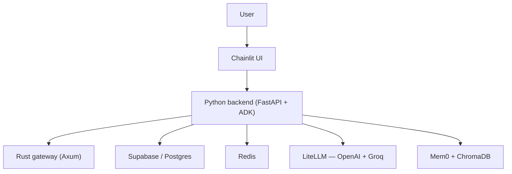
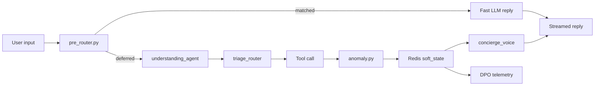

# AI Property Booking Concierge — V2.5

## Description

AI Property Booking Concierge is a hybrid Python and Rust system for property discovery, FAQ lookup, booking capture, and reservation follow-up. V2.5 extends the V2 Google ADK pipeline with a structured understanding layer, a fast deterministic pre-router, a fully soft-coded tool registry, and a Rust zero-latency FAQ intercept.
=======
# AI Property Booking Concierge V2.5

## Description

AI Property Booking Concierge V2.5 is a hybrid Python and Rust booking system for property search, FAQ lookup, booking capture, and reservation follow-up. The V2 rewrite replaces the earlier orchestration path with a pure Google ADK 2.0 `SequentialAgent` pipeline defined in [adk_agents.py](backend/app/agents/adk_agents.py).

The design splits one turn across four responsibilities. A deterministic pre-router handles greetings and out-of-scope intents. An understanding model emits a typed frame. A dispatcher model picks one tool. A voice model writes the final reply. Nothing about agent behavior is hard-coded in Python. Thresholds, intents, prompts, tool metadata, response styles, and fallback copy all live under [backend/app/config/](backend/app/config/) and [backend/app/prompts/](backend/app/prompts/).

## Architecture



The user talks to Chainlit. The FastAPI backend runs the ADK pipeline and delegates hot paths to the Rust gateway. Supabase stores thread history, Redis holds ADK session snapshots and anomaly counters, Mem0 stores durable user context, and LiteLLM fronts both OpenAI and Groq.

### Agent Pipeline (V2.5)

V2.5 runs a three-node ADK `SequentialAgent` defined in [adk_agents.py](backend/app/agents/adk_agents.py). Each node has one job.

| Node | Role | Model | Output |
|------|------|-------|--------|
| `understanding_agent` | Classify intent, entities, mood | Dispatcher (e.g. `openai/gpt-5-nano`) via [LiteLLM](https://docs.litellm.ai/) | Typed [UnderstandingFrame](backend/app/agents/schemas/understanding_frame.py) JSON |
| `triage_router` | Pick exactly one tool | Dispatcher | `router_output` with tool call |
| `concierge_voice` | Write the final reply | Voice (e.g. `groq/llama-3.3-70b-versatile`) | Streamed markdown text |

The three-node pipeline is gated by `features.understanding_frame_enabled` in [agent_config.yaml](backend/app/config/agent_config.yaml). When disabled, the pipeline reverts to the V2 two-node form (`triage_router` → `concierge_voice`).

Before ADK runs, the [pre_router.py](backend/app/services/pre_router.py) stage applies deterministic intent detection for greetings, thanks, goodbye, acknowledgements, and out-of-scope queries. When a match occurs, a fast Groq model (`groq/llama-3.1-8b-instant` by default) generates the reply and the ADK pipeline is skipped for that turn.



### Tool Registry

Tools are declared in [tool_registry.yaml](backend/app/config/tool_registry.yaml) and loaded by [tool_registry_loader.py](backend/app/config/tool_registry_loader.py). Adding a tool means writing the Python function under [backend/app/agents/tools/](backend/app/agents/tools/) and appending one YAML block — no edits to `adk_agents.py`.

| Tool | Module | Role |
|------|--------|------|
| `search_properties` | [search.py](backend/app/agents/tools/search.py) | Property search via Rust gateway with Python fallback |
| `get_property_details` | [search.py](backend/app/agents/tools/search.py) | Full details for a specific property |
| `select_property` | [search.py](backend/app/agents/tools/search.py) | Resolve a user selection against the active shortlist |
| `get_all_available_cities` | [search.py](backend/app/agents/tools/search.py) | City list from the dataset |
| `check_faq` | [support.py](backend/app/agents/tools/support.py) | Policy lookup via Rust CAG, RAG fallback |
| `check_booking_status` | [support.py](backend/app/agents/tools/support.py) | Booking status lookup by ID |
| `handle_small_talk` | [support.py](backend/app/agents/tools/support.py) | Greetings, thanks, out-of-scope redirect |
| `escalate_to_human` | [support.py](backend/app/agents/tools/support.py) | Handoff to a human agent |
| `request_booking_details` | [booking.py](backend/app/agents/tools/booking.py) | Collect missing booking fields |
| `review_booking_details` | [booking.py](backend/app/agents/tools/booking.py) | Show a booking summary for confirmation |
| `process_v2_booking` | [booking.py](backend/app/agents/tools/booking.py) | Finalize and persist the booking |

### State Layers

State is split into three layers, each owned by one component.

- **Durable user memory** — [memory_engine.py](backend/app/services/memory_engine.py) uses local [Mem0](https://mem0.ai/) with [ChromaDB](https://www.trychroma.com/) for long-lived user preferences. Embeddings come from [BAAI/bge-base-en-v1.5](https://huggingface.co/BAAI/bge-base-en-v1.5).
- **Session state** — [adk_runner.py](backend/app/services/adk_runner.py) and [redis_store.py](backend/app/services/redis_store.py) keep ADK events and `soft_state` (including `active_property_options_map`) in Redis snapshots. The custom `RedisSessionService` replaces ADK's in-memory session service.
- **Thread state** — [chainlit_app.py](frontend/chainlit_app.py) pins Chainlit's `thread_id` to the ADK `session_id` and persists thread data via SQLAlchemy against Supabase/PostgreSQL or a local SQLite fallback.

### Rust Gateway

The Rust service in [backend/rust_gateway/](backend/rust_gateway/) runs on [Axum](https://docs.rs/axum/latest/axum/) and exposes four things.

- A cache-augmented FAQ intercept in [cag.rs](backend/rust_gateway/src/cag.rs) that matches queries against [cag_policies.toml](backend/rust_gateway/config/cag_policies.toml) using keyword overlap then [Jaro-Winkler similarity](https://en.wikipedia.org/wiki/Jaro%E2%80%93Winkler_distance) via [`strsim`](https://docs.rs/strsim/). Policies hot-reload through `POST /admin/reload-cag` using [`arc-swap`](https://docs.rs/arc-swap/).
- A tool gateway in [gateway.rs](backend/rust_gateway/src/gateway.rs) that dispatches property search, booking validation, pricing, sentiment, and fraud checks.
- A per-IP sliding-window rate limiter in [rate_limiter.rs](backend/rust_gateway/src/rate_limiter.rs) that returns [`HTTP 429`](https://developer.mozilla.org/en-US/docs/Web/HTTP/Status/429) when exceeded.
- A TOON serializer in [toon.rs](backend/rust_gateway/src/toon.rs) mirroring the Python implementation in [toon.py](backend/app/services/toon.py). Python and Rust negotiate format via the [Content-Type](https://developer.mozilla.org/en-US/docs/Web/HTTP/Headers/Content-Type) and [Accept](https://developer.mozilla.org/en-US/docs/Web/HTTP/Headers/Accept) headers, selecting `application/toon` when both sides agree.

## Workflow

A turn enters in [chainlit_app.py](frontend/chainlit_app.py), where the message is bound to the active `thread_id`, which also serves as the ADK `session_id`. The message flows into [adk_runner.py](backend/app/services/adk_runner.py), which runs input sanitization in [guardrails.py](backend/app/security/guardrails.py), hydrates the Redis session snapshot, fetches Mem0 context if the query has enough signal, and invokes the pre-router.

If the pre-router defers, ADK runs the three nodes in order. The understanding node emits an `UnderstandingFrame`. The triage node reads that frame and calls exactly one tool. [anomaly.py](backend/app/security/anomaly.py) hashes the `(tool_name, params)` pair and raises a routing anomaly if the same pair repeats beyond the threshold inside the window. The voice node reads the tool output and streams the reply back through Chainlit using [`ReadableStream`](https://developer.mozilla.org/en-US/docs/Web/API/ReadableStream)-style token streaming, similar in spirit to [Server-sent events](https://developer.mozilla.org/en-US/docs/Web/API/Server-sent_events).

Search tools apply a token-safe summary mode in both languages. In [search.py](backend/app/agents/tools/search.py) and [search.rs](backend/rust_gateway/src/tools/search.rs), heavy fields are dropped once the result count crosses `summary_mode_threshold` in [agent_config.yaml](backend/app/config/agent_config.yaml). This keeps responses within Groq's tokens-per-minute budget.

Observability is decoupled from the user path. [telemetry.py](backend/app/observability/telemetry.py) classifies each trajectory as `SUCCESS_PATH`, `DROP_OFF_PATH`, or `IN_PROGRESS` and writes it fire-and-forget to SQLite, with a best-effort mirror to Supabase. The [export_dpo_dataset.py](backend/scripts/export_dpo_dataset.py) script pairs these trajectories into DPO-ready JSONL for dispatcher-model fine-tuning.

The deterministic [policy_router.py](backend/app/security/policy_router.py) can audit or override router decisions based on [agent_policy.yaml](backend/app/config/agent_policy.yaml). Its mode is controlled by `POLICY_ROUTER_MODE` (`off`, `shadow`, or `enforce`), letting new routing rules ship as logged shadow decisions before they take over.

## Environment Flags

Every flag below is read at startup from the environment and falls back to a YAML default. The template in [env.example](env.example) lists the full set.

| Variable | Default | Effect |
|----------|---------|--------|
| `ADK_DISPATCHER_MODEL` | `openai/gpt-5-nano` | LiteLLM model for `understanding_agent` and `triage_router` |
| `ADK_VOICE_MODEL` | `groq/llama-3.3-70b-versatile` | LiteLLM model for `concierge_voice` |
| `PRE_ROUTER_FAST_MODEL` | `groq/llama-3.1-8b-instant` | Fast LLM used by the pre-router for small talk and scope refusal |
| `UNDERSTANDING_FRAME_ENABLED` | `1` | Toggle the three-node pipeline on or off |
| `TOOL_REGISTRY_ENABLED` | `1` | Load tools from [tool_registry.yaml](backend/app/config/tool_registry.yaml) instead of the hardcoded import list |
| `RESPONSE_POLICIES_ENABLED` | `1` | Enable response-policy snippets injected into the voice prompt |
| `POLICY_ROUTER_MODE` | `shadow` | `off`, `shadow`, or `enforce` for [policy_router.py](backend/app/security/policy_router.py) |
| `ANOMALY_TOOL_LOOP_THRESHOLD` | `3` | Identical tool calls before raising `ROUTING_ANOMALY` |
| `ANOMALY_TIME_WINDOW_SECONDS` | `30` | Sliding window used by the anomaly guard |
| `DPO_TELEMETRY_ENABLED` | `1` | Persist trajectories to SQLite plus Supabase mirror |
| `RUST_RATE_LIMIT_MAX` | `10` | Max requests per IP per window in the Rust gateway |
| `RUST_RATE_LIMIT_WINDOW_SECS` | `10` | Rate-limit window length |
| `REDIS_URL` | `redis://localhost:6379/0` | Redis connection used by the ADK session service and anomaly guard |
| `MEM0_ENABLED` | `1` | Toggle local Mem0 cognitive memory |

## Interesting Techniques

- **Probabilistic routing with deterministic state resolution**: the triage model can infer "option 4" from loose language, but the actual property UUID is resolved against `active_property_options_map` in Redis `soft_state`, keeping identity exact while keeping language flexible.
- **Two-stage pre-router**: deterministic detection in [pre_router.py](backend/app/services/pre_router.py) decides *whether* to fast-path; a separate generator LLM decides *what to say*. This avoids canned regex replies while still bypassing the full ADK pipeline.
- **Structured LLM output as an inter-agent contract**: `understanding_agent` emits a Pydantic [UnderstandingFrame](backend/app/agents/schemas/understanding_frame.py) enforced through ADK's `output_schema`. Downstream nodes consume a typed object instead of parsing free-form text.
- **Shadow-mode policy routing**: [policy_router.py](backend/app/security/policy_router.py) runs alongside the LLM router, logs disagreements, and can later enforce — the same pattern used for [feature flag](https://developer.mozilla.org/en-US/docs/Glossary/Feature_flag) rollout in web apps.
- **Hot-reloadable cache policies**: the Rust CAG store swaps its `Arc<CagStore>` atomically via `arc-swap` on an authenticated admin endpoint, avoiding restarts when policies change.
- **[Content negotiation](https://developer.mozilla.org/en-US/docs/Web/HTTP/Content_negotiation) for a custom wire format**: Python and Rust choose TOON or JSON per request based on `Content-Type` and `Accept` headers, so TOON stays opt-in.
- **Sliding-window rate limiting with proxy awareness**: [rate_limiter.rs](backend/rust_gateway/src/rate_limiter.rs) reads [`X-Forwarded-For`](https://developer.mozilla.org/en-US/docs/Web/HTTP/Headers/X-Forwarded-For) before falling back to the peer address, so limits survive behind Chainlit and reverse proxies.
- **Session-pinned streaming transport**: Chainlit streams tokens over a persistent connection similar to the [WebSockets API](https://developer.mozilla.org/en-US/docs/Web/API/WebSockets_API), while canonical state lives in Redis and Supabase so reconnects and hot reloads do not lose conversation identity.
- **Super soft-coded orchestration**: every threshold, intent set, fallback phrase, tool, prompt, and policy lives in YAML or Markdown under [backend/app/config/](backend/app/config/) and [backend/app/prompts/](backend/app/prompts/), loaded through dot-access namespaces in [agent_config_loader.py](backend/app/config/agent_config_loader.py).
- **Fire-and-forget DPO capture**: [telemetry.py](backend/app/observability/telemetry.py) classifies trajectories and writes them off the user request path via [`asyncio.loop.run_in_executor`](https://docs.python.org/3/library/asyncio-eventloop.html#asyncio.loop.run_in_executor), with a Supabase mirror on a separate task.

## Non-Obvious Technologies

- [google-adk](https://google.github.io/adk-docs/) — provides `SequentialAgent`, `LlmAgent`, `Runner`, and session abstractions.
- [LiteLLM](https://docs.litellm.ai/) — single call surface for OpenAI (`gpt-5-nano`) and Groq (`llama-3.3-70b-versatile`, `llama-3.1-8b-instant`).
- [Mem0](https://mem0.ai/) — open-source cognitive memory layer, used locally with no cloud dependency.
- [ChromaDB](https://www.trychroma.com/) — embedding store for Mem0 and FAQ RAG.
- [sentence-transformers](https://www.sbert.net/) with [BAAI/bge-base-en-v1.5](https://huggingface.co/BAAI/bge-base-en-v1.5) — embedding backbone.
- [LangChain](https://python.langchain.com/) text splitters and `langchain-chroma` — used in [faq_enhanced.py](backend/app/components/faq_enhanced.py) for policy PDF ingestion.
- [rank-bm25](https://pypi.org/project/rank-bm25/) — BM25 keyword branch of hybrid FAQ retrieval.
- [vaderSentiment](https://github.com/cjhutto/vaderSentiment) and [spaCy](https://spacy.io/) — sentiment and NLP signals used by [nlp_engine.py](backend/app/components/nlp_engine.py).
- [Chainlit](https://docs.chainlit.io/) with [SQLAlchemyDataLayer](https://docs.chainlit.io/data-persistence/overview) — chat UI and persistence bridge.
- [FastAPI](https://fastapi.tiangolo.com/) and [Uvicorn](https://www.uvicorn.org/) — backend HTTP surface in [main.py](backend/app/main.py).
- [Axum](https://docs.rs/axum/latest/axum/), [Tokio](https://tokio.rs/), [Tower-HTTP](https://docs.rs/tower-http/latest/tower_http/) — Rust service stack.
- [`arc-swap`](https://docs.rs/arc-swap/) — atomic hot-reload of the CAG policy store.
- [`strsim`](https://docs.rs/strsim/) — Jaro-Winkler distance for fuzzy FAQ matching.
- [Supabase](https://supabase.com/) with [`psycopg`](https://www.psycopg.org/psycopg3/docs/) — Postgres layer for threads, feedback, and telemetry mirror.
- [redis-py](https://redis.readthedocs.io/en/stable/) with `hiredis` — ADK session snapshots and anomaly counters.
- [PM2](https://pm2.keymetrics.io/) — process supervision in [ecosystem.config.js](ecosystem.config.js).
- [Stripe](https://stripe.com/docs/api) — booking payment links in [stripe_webhook.py](backend/app/route/stripe_webhook.py).
- TOON — a token-optimized object notation implemented locally in [toon.py](backend/app/services/toon.py) and [toon.rs](backend/rust_gateway/src/toon.rs).

The Chainlit UI renders in the system UI font by default. To switch to [Inter](https://fonts.google.com/specimen/Inter), uncomment `custom_font` in [.chainlit/config.toml](.chainlit/config.toml).

## Phase History

- **Phase 1** — Rust Cache-Augmented Generation (CAG) for FAQ intercepts in [cag.rs](backend/rust_gateway/src/cag.rs).
- **Phase 2** — ADK 2.0 dual-LLM `SequentialAgent` in [adk_agents.py](backend/app/agents/adk_agents.py).
- **Phase 3** — Continuous learning with DPO telemetry in [telemetry.py](backend/app/observability/telemetry.py), anomaly detection in [anomaly.py](backend/app/security/anomaly.py), rate limiting in [rate_limiter.rs](backend/rust_gateway/src/rate_limiter.rs), and RLHF export via [export_dpo_dataset.py](backend/scripts/export_dpo_dataset.py).
- **Phase 4** — 100% native V2: LangGraph removed, native LLM tool-calling for bookings in [booking.py](backend/app/agents/tools/booking.py).
- **Phase 5 (V2.5)** — Three-node pipeline with [understanding_agent](backend/app/agents/schemas/understanding_frame.py), pre-router fast path in [pre_router.py](backend/app/services/pre_router.py), soft-coded [tool_registry.yaml](backend/app/config/tool_registry.yaml), deterministic [policy_router.py](backend/app/security/policy_router.py), and Redis-backed [RedisSessionService](backend/app/services/adk_runner.py).

## Project Structure

```text
Hotel-booking/
├── backend/
│   ├── app/
│   │   ├── agents/
│   │   │   ├── prompts/
│   │   │   ├── resolvers/
│   │   │   ├── schemas/
│   │   │   ├── state/
│   │   │   └── tools/
│   │   ├── components/
│   │   ├── config/
│   │   ├── observability/
│   │   ├── prompts/
│   │   ├── route/
│   │   ├── security/
│   │   └── services/
│   ├── data/
│   ├── evaluation/
│   ├── infrastructure/
│   ├── rust_gateway/
│   │   ├── config/
│   │   └── src/
│   │       └── tools/
│   ├── scripts/
│   └── tests/
├── docs/
├── frontend/
│   └── public/
├── .github/
│   └── workflows/
└── .chainlit/
```

[backend/app/agents/](backend/app/agents/) contains the three-node ADK pipeline in [adk_agents.py](backend/app/agents/adk_agents.py), the `UnderstandingFrame` contract under [schemas/](backend/app/agents/schemas/), the state helpers under [state/](backend/app/agents/state/), and the Python tool layer under [tools/](backend/app/agents/tools/).

[backend/app/components/](backend/app/components/) holds the retrieval stack: hybrid vector and BM25 search, FAQ RAG over policy PDFs in [faq_enhanced.py](backend/app/components/faq_enhanced.py), and the NLP engine in [nlp_engine.py](backend/app/components/nlp_engine.py).

[backend/app/config/](backend/app/config/) is the control plane. [agent_config.yaml](backend/app/config/agent_config.yaml) drives thresholds and fallbacks, [tool_registry.yaml](backend/app/config/tool_registry.yaml) declares tools, [agent_policy.yaml](backend/app/config/agent_policy.yaml) encodes deterministic routing, [booking_schema.yaml](backend/app/config/booking_schema.yaml) defines booking fields, and [response_policies.yaml](backend/app/config/response_policies.yaml) shapes the voice node.

[backend/app/observability/](backend/app/observability/) contains DPO telemetry, DB logging, and tracing.

[backend/app/prompts/](backend/app/prompts/) stores the externalized Markdown prompts for understanding, triage, and voice.

[backend/app/route/](backend/app/route/) contains FastAPI handlers for chat, admin, health, properties, booking, FAQ, mobile, and the Stripe webhook.

[backend/app/security/](backend/app/security/) holds [anomaly.py](backend/app/security/anomaly.py), [guardrails.py](backend/app/security/guardrails.py), and the deterministic [policy_router.py](backend/app/security/policy_router.py).

[backend/app/services/](backend/app/services/) wires the ADK runner, Redis session service, pre-router, Mem0 memory engine, TOON codec, booking, Supabase/Postgres client, and dynamic config loaders.

[backend/rust_gateway/](backend/rust_gateway/) contains the Axum service, CAG intercept, rate limiter, TOON codec, and tool implementations.

[backend/scripts/](backend/scripts/) contains [export_dpo_dataset.py](backend/scripts/export_dpo_dataset.py), [finetune_openai.py](backend/scripts/finetune_openai.py), [generate_cag_policies.py](backend/scripts/generate_cag_policies.py), [rebuild_rag_index.py](backend/scripts/rebuild_rag_index.py), and [initialize_faq.py](backend/scripts/initialize_faq.py).

[backend/evaluation/](backend/evaluation/) holds the offline evaluation suite referenced by [.github/workflows/ci.yml](.github/workflows/ci.yml).

[frontend/](frontend/) contains [chainlit_app.py](frontend/chainlit_app.py) and the custom branding assets under [frontend/public/](frontend/public/).

[docs/](docs/) covers [architecture.md](docs/architecture.md), [api-reference.md](docs/api-reference.md), [deployment.md](docs/deployment.md), and [finetuning_playbook.md](docs/finetuning_playbook.md).
