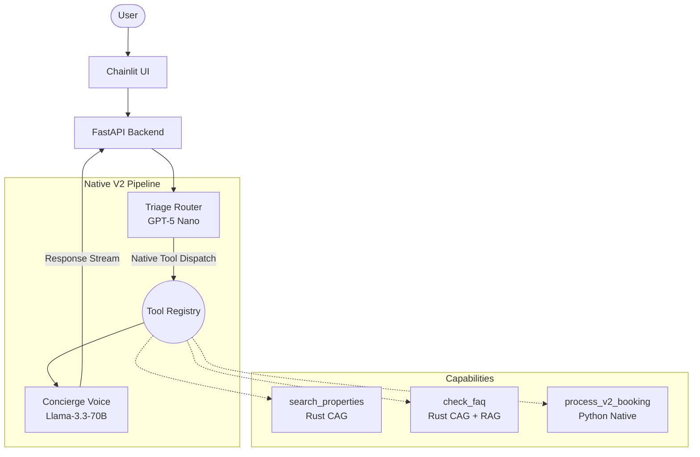

# AI Property Booking Concierge V2

AI Property Booking Concierge V2 is a property booking application utilizing a dual-LLM architecture. Its primary functions include searching for properties, filtering shortlists, processing bookings, handling FAQs, and checking reservation statuses.

The latest version replaces LangGraph with a 100% native SequentialAgent pipeline. System coordination is handled by Python, logic policies are managed with YAML configurations, and instructions are driven by Markdown templates.

## Architecture

This project employs a dual-model pattern to separate routing choices from conversation generation. A routing model classifies intents and triggers tools, while a secondary model synthesizes the returned data into readable responses.



## Interesting Techniques

- **Loop Anomaly Detection**: The system tracks repeated identical tool interactions over sliding time windows to detect state machine looping. If a loop is caught, it falls back to a human-readable error. [Read more about tracking time performance with the browser Performance API](https://developer.mozilla.org/en-US/docs/Web/API/Performance_API).
- **Token-Safe Data Truncation**: When search tools hit a specific threshold, they aggressively truncate heavy text fields (like full property descriptions). This stops token limit issues while maintaining a broad query space.
- **Pinned Session Storage**: Interaction states are bound directly to explicit IDs stored in a Redis database. This bypasses client-side storage issues and simulates the persistent connection of [WebSockets](https://developer.mozilla.org/en-US/docs/Web/API/WebSockets_API) over standard HTTP.
- **State-Aware Merging**: The application iteratively merges new user inputs into an active booking state without forgetting prior inputs or requiring full payload replacements.

## Technologies Used

- [Chainlit](https://chainlit.io/): Manages the conversational frontend interface and chat session routing.
- [FastAPI](https://fastapi.tiangolo.com/): An async web framework driving the backend tool integration.
- [LiteLLM](https://litellm.ai/): A proxy layer enabling a universal interface for the different AI model providers used in the dual-LLM setup.
- [Axum](https://github.com/tokio-rs/axum): A web application framework managing the high-throughput Rust endpoints.
- [ChromaDB](https://www.trychroma.com/): A local vector database acting as the retrieval mechanism for semantic searches.
- Typography relies on modern browser default sans-serif stacks, occasionally leaning on [Inter](https://fonts.google.com/specimen/Inter) for layout clarity.

## Project Structure

```text
.
├── backend/
│   ├── app/
│   │   ├── agents/
│   │   │   └── tools/
│   │   ├── components/
│   │   ├── config/
│   │   ├── observability/
│   │   ├── prompts/
│   │   ├── security/
│   │   ├── services/
│   │   └── route/
│   └── rust_gateway/
│       └── src/
│           └── tools/
└── frontend/
```

- [backend/app/agents/](backend/app/agents/): Contains the routing algorithms and tool executions for the model pipeline.
- [backend/app/config/](backend/app/config/): Stores YAML settings dictating system thresholds, policies, and configuration.
- [backend/app/observability/](backend/app/observability/): Handles telemetry tracking and logging to improve system responses over time.
- [backend/rust_gateway/](backend/rust_gateway/): Hosts API endpoints prioritizing data throughput for property searches.
- [frontend/](frontend/): Runs the main interface application structure connecting the backend tool layer.
