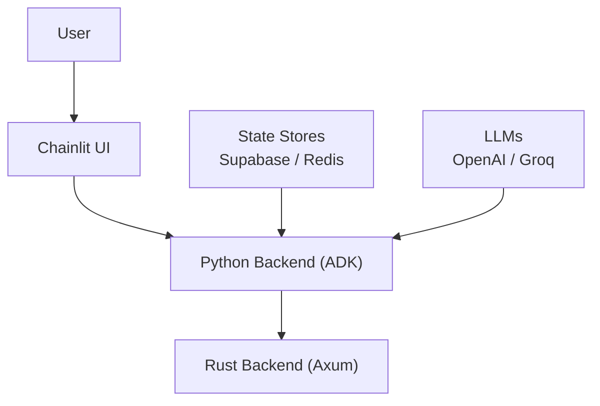
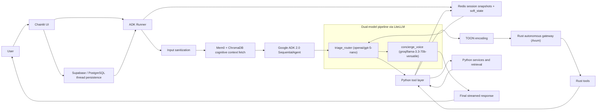
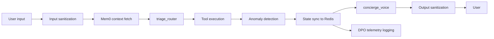

# AI Property Booking Concierge V2

## Description

AI Property Booking Concierge V2 is a hybrid Python and Rust booking system for property search, FAQ lookup, booking capture, and reservation follow-up. The V2 rewrite replaces the earlier orchestration path with a pure Google ADK 2.0 `SequentialAgent` pipeline defined in [adk_agents.py](backend/app/agents/adk_agents.py).

At a high level, the system separates decision-making from response writing. One model decides which backend action should run next. A second model turns structured results into the final reply. The backend keeps conversation state across turns, stores durable user context, and offloads selected search work to a Rust service.

The codebase follows a "super soft coded" approach. Python is used for wiring, not policy. Thresholds, intent sets, fallback messages, and other runtime controls live in [agent_config.yaml](backend/app/config/agent_config.yaml). Prompt behavior is kept in [triage_instruction.md](backend/app/prompts/triage_instruction.md) and [voice_instruction.md](backend/app/prompts/voice_instruction.md), so agent behavior can change without rewriting the orchestration layer.

## Architecture



For semi-technical readers, the system is simple in shape: the user talks to a Chainlit interface, the Python backend runs the ADK agent pipeline, and the Rust backend handles fast tool execution and search-related work. Supporting systems store state and provide model access.

Under the hood, V2 is a two-node ADK pipeline. In [adk_agents.py](backend/app/agents/adk_agents.py), `triage_router` uses `openai/gpt-5-nano` through LiteLLM as a probabilistic state router. Its job is narrow: select one tool call and return structured data. It does not generate conversational text. `concierge_voice` uses `groq/llama-3.3-70b-versatile` through LiteLLM to read tool output and produce the final user-facing response.

This separation keeps routing logic and response style independent. The router is optimized for choosing the next action. The voice model is optimized for presenting the result clearly. Because the prompts are externalized into [triage_instruction.md](backend/app/prompts/triage_instruction.md) and [voice_instruction.md](backend/app/prompts/voice_instruction.md), the orchestration code remains small and mostly declarative.

V2 also formalizes memory and state into three layers.

- Long-term cognitive memory: [memory_engine.py](backend/app/services/memory_engine.py) uses local Mem0 with ChromaDB-backed storage to retrieve historical user context such as preferences, travel patterns, or prior constraints. That context is injected into the model turn as cognitive state.
- Short-term session state: [adk_runner.py](backend/app/services/adk_runner.py) and [redis_store.py](backend/app/services/redis_store.py) manage Redis-backed ADK session snapshots and `soft_state`. This is where `active_property_options_map` lives, allowing fuzzy user choices such as "option 15" to resolve deterministically to a property UUID.
- Persistent UI thread state: [chainlit_app.py](frontend/chainlit_app.py) pins the Chainlit `thread_id` to the ADK `session_id` and persists thread data through a SQLAlchemy data layer backed by Supabase/PostgreSQL. This keeps the same conversation identity stable across browser refreshes and backend hot-reloads.

The Rust side acts as an autonomous tool gateway. Python tools in [backend/app/agents/tools/](backend/app/agents/tools/) prepare structured requests, while the Rust service in [backend/rust_gateway/src/](backend/rust_gateway/src/) handles tool routing and search execution behind Axum. The boundary between Python and Rust uses TOON, implemented in [toon.py](backend/app/services/toon.py) and [toon.rs](backend/rust_gateway/src/toon.rs), to keep payloads compact and model-friendly.



## Workflow

A turn starts in [chainlit_app.py](frontend/chainlit_app.py), where the incoming message is attached to the active `thread_id`, and that same identifier is reused as the ADK `session_id`. The request moves into [adk_runner.py](backend/app/services/adk_runner.py), which sanitizes input, hydrates the Redis-backed session, and fetches Mem0 context before the ADK pipeline runs.

The router then selects one tool call. Tool execution happens in Python, with selected search and gateway operations delegated to Rust. After each tool call, [anomaly.py](backend/app/security/anomaly.py) checks whether the router is repeating the same tool with the same parameter hash inside the configured time window. If the pattern crosses the threshold, the system raises a routing anomaly and falls back safely. Exemptions such as small-talk handling are configured in [agent_config.yaml](backend/app/config/agent_config.yaml), not hardcoded in the anomaly checker.

Search tools run a token-safe summary mode in both languages. In [search.py](backend/app/agents/tools/search.py) and [search.rs](backend/rust_gateway/src/tools/search.rs), large result sets drop heavy fields such as descriptions and amenities once the count exceeds `summary_mode_threshold`. That keeps large searches inside Groq's stricter token-per-minute budget while preserving enough structure for shortlist presentation and deterministic follow-up selection.

Observability is handled separately from the user path. [telemetry.py](backend/app/observability/telemetry.py) logs DPO telemetry trajectories to a local SQLite database, capturing tool calls, latency, sanitized input/output, and cognitive context. This keeps the runtime inspectable without mixing telemetry concerns into the ADK pipeline itself.

The state model is the key V2 design choice. Routing is probabilistic, but state resolution is not. The router can loosely infer that "the cheaper one from before" refers to a prior shortlist, but the actual mapping is handled by `active_property_options_map` in Redis-backed `soft_state`. That separation lets the model stay flexible on language while the backend stays exact on identity.



## Interesting Techniques

- Deterministic state memory vs probabilistic routing: the router can interpret flexible user language, but the backend resolves selections through `active_property_options_map` in Redis-backed `soft_state`, so the final property mapping stays exact.
- Token-safe dynamic payload pruning: Python and Rust both apply the same summary-mode rule, removing large text fields when result sets become too large for the voice model's token budget.
- Context-aware anomaly detection: [anomaly.py](backend/app/security/anomaly.py) hashes tool parameters and detects repeated identical tool calls within a sliding window, while exempting allowed cases such as small talk through config.
- Pinned session state across streaming transport: the UI behaves like a long-lived [WebSockets API](https://developer.mozilla.org/en-US/docs/Web/API/WebSockets_API) or [Server-sent events](https://developer.mozilla.org/en-US/docs/Web/API/Server-sent_events) session, but canonical state remains in Redis and Supabase so conversation identity survives reconnects and reloads.
- Super soft-coded orchestration: behavior moves through config and prompt files instead of application constants, which reduces policy drift between the agent layer and the tool layer.

## Non-Obvious Technologies

- `google.adk`: provides the `SequentialAgent`, runner, and session abstractions used in [adk_agents.py](backend/app/agents/adk_agents.py) and [adk_runner.py](backend/app/services/adk_runner.py).
- `LiteLLM`: normalizes access to both OpenAI and Groq models inside the same ADK pipeline.
- `Mem0`: stores and retrieves durable user-level memory in [memory_engine.py](backend/app/services/memory_engine.py).
- `ChromaDB`: backs the local vector storage used for cognitive memory and retrieval-related workflows.
- `Supabase`: provides PostgreSQL-backed persistent thread storage used by [chainlit_app.py](frontend/chainlit_app.py).
- `Chainlit`: provides the chat UI and the thread model that anchors the session bridge.
- `Axum`: serves the Rust gateway in [main.rs](backend/rust_gateway/src/main.rs).
- `TOON`: a compact serialization format used at the Python/Rust boundary in [toon.py](backend/app/services/toon.py) and [toon.rs](backend/rust_gateway/src/toon.rs).

## Project Structure

```text
backend/
|-- app/
|   |-- agents/
|   |   |-- adk_agents.py
|   |   `-- tools/
|   |-- components/
|   |-- config/
|   |   |-- agent_config.yaml
|   |   `-- agent_config_loader.py
|   |-- observability/
|   |-- prompts/
|   |   |-- triage_instruction.md
|   |   `-- voice_instruction.md
|   |-- security/
|   |   |-- anomaly.py
|   |   `-- guardrails.py
|   `-- services/
|       |-- adk_runner.py
|       |-- redis_store.py
|       `-- memory_engine.py
|-- rust_gateway/
|   `-- src/
|       |-- main.rs
|       |-- gateway.rs
|       |-- toon.rs
|       `-- tools/
|           `-- search.rs
`-- frontend/
    `-- chainlit_app.py
```

[backend/app/agents/](backend/app/agents/) contains the ADK pipeline wiring and the Python tool contracts exposed to the router.

[backend/app/components/](backend/app/components/) holds retrieval, search, and semantic matching helpers used by property and FAQ flows.

[backend/app/config/](backend/app/config/) is the control plane for thresholds, intent sets, fallback messages, and model defaults.

[backend/app/observability/](backend/app/observability/) contains telemetry and tracing code for DPO logging and runtime inspection.

[backend/app/prompts/](backend/app/prompts/) stores the externalized Markdown prompts for the router and voice nodes.

[backend/app/security/](backend/app/security/) contains anomaly detection and sanitization guardrails.

[backend/app/services/](backend/app/services/) handles the ADK runner, Redis session snapshots, memory retrieval, TOON serialization, and backend services.

[backend/rust_gateway/src/](backend/rust_gateway/src/) contains the Axum server, tool gateway, TOON support, and Rust search tools.

[frontend/](frontend/) contains the Chainlit application and the frontend-to-session persistence bridge.
