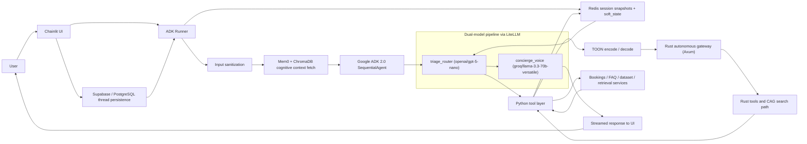
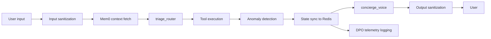

# AI Property Booking Concierge V2

## Description

AI Property Booking Concierge V2 is a hybrid Python and Rust booking system built around a pure Google ADK 2.0 `SequentialAgent` pipeline. The Python side is intentionally thin: it wires agents, session services, tool boundaries, and persistence. Runtime behavior is soft-coded in [agent_config.yaml](backend/app/config/agent_config.yaml), while prompt behavior is externalized into [triage_instruction.md](backend/app/prompts/triage_instruction.md) and [voice_instruction.md](backend/app/prompts/voice_instruction.md).

The main agent graph lives in [adk_agents.py](backend/app/agents/adk_agents.py). It splits the conversation loop into two separate model responsibilities. `triage_router` runs `openai/gpt-5-nano` through LiteLLM and acts as a probabilistic router that emits one structured tool call. It does not write user-facing prose. `concierge_voice` runs `groq/llama-3.3-70b-versatile` through LiteLLM and turns structured tool payloads into the final response.

V2 also moves state handling into three explicit layers instead of relying on one conversational context blob. Long-term cognitive context comes from local Mem0 backed by ChromaDB in [memory_engine.py](backend/app/services/memory_engine.py). Short-term operational state is stored in Redis through the custom `RedisSessionService` inside [adk_runner.py](backend/app/services/adk_runner.py) and the snapshot helpers in [redis_store.py](backend/app/services/redis_store.py). Persistent UI threads are managed in [chainlit_app.py](frontend/chainlit_app.py), where Chainlit's SQLAlchemy data layer is backed by Supabase Postgres via `postgresql+psycopg`, and `thread_id` is reused as the ADK `session_id` so session identity survives reloads and reconnects.

## Architecture

The V2 rewrite replaces the older orchestration path with a single ADK runner in [adk_runner.py](backend/app/services/adk_runner.py). Each turn starts with input sanitization, cognitive context fetch, and ADK session hydration. The runner then invokes the two-node `SequentialAgent` defined in [adk_agents.py](backend/app/agents/adk_agents.py), records tool activity, applies anomaly checks, streams response chunks back to Chainlit, and logs the trajectory for later analysis.

The architecture is intentionally asymmetric:

- `triage_router` is a routing model, not a chat model. Its contract is defined in [triage_instruction.md](backend/app/prompts/triage_instruction.md): choose exactly one tool, emit structured output, and stop.
- `concierge_voice` is a rendering model. Its contract is defined in [voice_instruction.md](backend/app/prompts/voice_instruction.md): read the router payload, use any injected cognitive memory, and write the final response without exposing raw tool internals.
- All non-probabilistic controls such as thresholds, fallback messages, intent classes, exemption lists, and summary-mode limits live in [agent_config.yaml](backend/app/config/agent_config.yaml), not in the agent wiring.

The memory model is equally explicit:

- Long-term cognitive memory: [memory_engine.py](backend/app/services/memory_engine.py) initializes local Mem0 with `BAAI/bge-large-en-v1.5` embeddings and a Chroma-backed vector store. On each turn, the runner fetches relevant user facts and injects them into `user_cognitive_context`.
- Short-term session state: [adk_runner.py](backend/app/services/adk_runner.py) implements `RedisSessionService`, while [redis_store.py](backend/app/services/redis_store.py) persists ADK session snapshots. This is where `soft_state` and `active_property_options_map` live, so probabilistic references like "option 15" can be resolved to a deterministic property UUID.
- Persistent UI thread state: [chainlit_app.py](frontend/chainlit_app.py) uses Chainlit's SQLAlchemy data layer with Supabase Postgres and keeps `thread_id == session_id`. That bridge gives the frontend a durable identity that lines up with Redis-backed ADK state instead of creating a new conversation context on every refresh.

The search and retrieval path is split across Python and Rust. Python tools in [backend/app/agents/tools/](backend/app/agents/tools/) shape ADK tool contracts and maintain conversational state. Retrieval and semantic search live in [backend/app/components/](backend/app/components/). When appropriate, Python passes compact TOON payloads through [toon.py](backend/app/services/toon.py) to the Rust gateway, where [main.rs](backend/rust_gateway/src/main.rs), [gateway.rs](backend/rust_gateway/src/gateway.rs), [toon.rs](backend/rust_gateway/src/toon.rs), and Rust tools such as [search.rs](backend/rust_gateway/src/tools/search.rs) run behind Axum.



## Workflow

Each turn follows the same narrow path, and the boundaries are deliberate.

1. [chainlit_app.py](frontend/chainlit_app.py) receives the user message, resolves `session_id` from the Chainlit `thread_id`, and streams output chunks back to the UI.
2. [adk_runner.py](backend/app/services/adk_runner.py) sanitizes the input, loads the Redis-backed ADK session snapshot, and fetches long-term user context from [memory_engine.py](backend/app/services/memory_engine.py).
3. `triage_router` chooses one tool call. It does not produce end-user text.
4. The selected tool executes in Python, and may call into the Rust gateway for fast filtering or CAG-backed retrieval.
5. [anomaly.py](backend/app/security/anomaly.py) hashes the tool parameters and checks whether the same tool is being called repeatedly inside the configured time window. Repeated calls from exempt tools remain allowed through [agent_config.yaml](backend/app/config/agent_config.yaml).
6. The updated `soft_state` and ADK event history are written back through the Redis session service.
7. `concierge_voice` reads the structured result plus cognitive context and generates the final response.
8. Output is sanitized and the full trajectory is logged in [telemetry.py](backend/app/observability/telemetry.py), including tool calls, latency, cognitive context, and sanitized reply text.

Search has an additional token-safety branch. In [search.py](backend/app/agents/tools/search.py), once the result count crosses `summary_mode_threshold`, the tool omits heavy fields such as descriptions and amenities before handing the payload to the model. The Rust implementation in [search.rs](backend/rust_gateway/src/tools/search.rs) applies the same rule. That Python/Rust parity keeps large searches from pushing the Groq voice model into rate-limit failures while still preserving deterministic selection state in Redis.

The state model is the key V2 design choice. Routing is probabilistic, but state resolution is not. The router can loosely infer that "the cheaper one from before" refers to a prior shortlist, but the actual mapping is handled by `active_property_options_map` in Redis-backed `soft_state`. That separation lets the model stay flexible on language while the backend stays exact on identity.



## Interesting Techniques

- Deterministic state memory vs probabilistic routing: `triage_router` can interpret fuzzy selections, but the actual option-to-property mapping is stored in `active_property_options_map` inside Redis-backed `soft_state` in [search.py](backend/app/agents/tools/search.py) and [adk_runner.py](backend/app/services/adk_runner.py). The model decides intent; the backend decides identity.
- Token-safe dynamic payload pruning: both [search.py](backend/app/agents/tools/search.py) and [search.rs](backend/rust_gateway/src/tools/search.rs) switch into summary mode when the result count crosses `summary_mode_threshold`, removing descriptions and amenities so larger searches stay inside the voice model's token budget.
- Context-aware anomaly loop detection: [anomaly.py](backend/app/security/anomaly.py) hashes tool parameters, counts repeated identical calls inside a sliding window, and raises `[ROUTING_ANOMALY]` when the router starts repeating itself. Exempt tools are configured in [agent_config.yaml](backend/app/config/agent_config.yaml), so harmless repetition is not treated as an attack or failure.
- Pinned session state across real-time transport: the frontend streams replies over the kind of long-lived channel typically associated with the [WebSockets API](https://developer.mozilla.org/en-US/docs/Web/API/WebSockets_API) or [Server-sent events](https://developer.mozilla.org/en-US/docs/Web/API/Server-sent_events), but canonical state lives in Redis and Supabase. That keeps the live transport separate from the durable conversation identity.
- Super soft-coded runtime control: thresholds, fallback copy, routing labels, booking field requirements, anomaly exemptions, and summary-mode limits live in [agent_config.yaml](backend/app/config/agent_config.yaml). Prompts are versioned separately in [backend/app/prompts/](backend/app/prompts/). Python stays focused on orchestration.

## Non-Obvious Technologies

- `google.adk`: the core runtime for `LlmAgent`, `SequentialAgent`, the runner, and the session service contract used by [adk_agents.py](backend/app/agents/adk_agents.py) and [adk_runner.py](backend/app/services/adk_runner.py).
- `Mem0`: local long-term memory extraction and retrieval in [memory_engine.py](backend/app/services/memory_engine.py), used to build per-user cognitive context.
- `ChromaDB`: the vector store used under local Mem0 in [memory_engine.py](backend/app/services/memory_engine.py), and also present in the retrieval stack in [retrieval.py](backend/app/components/retrieval.py).
- `Supabase` with SQLAlchemy and `psycopg`: the persistent thread backend used by [chainlit_app.py](frontend/chainlit_app.py) and the async Postgres client in [db_client.py](backend/app/services/db_client.py).
- `LiteLLM`: the provider abstraction layer that lets the same ADK pipeline call `openai/gpt-5-nano` and `groq/llama-3.3-70b-versatile` through one interface in [adk_agents.py](backend/app/agents/adk_agents.py).
- `Chainlit`: the chat UI and thread/session bridge defined in [chainlit_app.py](frontend/chainlit_app.py).
- `Axum`: the Rust HTTP boundary in [main.rs](backend/rust_gateway/src/main.rs) that exposes the autonomous gateway and direct tool endpoints.
- `TOON`: the compact serialization format implemented in [toon.py](backend/app/services/toon.py) and [toon.rs](backend/rust_gateway/src/toon.rs), used to move structured payloads across the Python/Rust boundary with lower token overhead than verbose JSON.

## Project Structure

```text
backend/
|-- app/
|   |-- agents/
|   |   |-- adk_agents.py
|   |   `-- tools/
|   |-- components/
|   |-- config/
|   |   |-- agent_config.yaml
|   |   `-- agent_config_loader.py
|   |-- observability/
|   |-- prompts/
|   |   |-- triage_instruction.md
|   |   `-- voice_instruction.md
|   |-- security/
|   |   |-- anomaly.py
|   |   `-- guardrails.py
|   `-- services/
|       |-- adk_runner.py
|       |-- redis_store.py
|       `-- memory_engine.py
|-- rust_gateway/
|   `-- src/
|       |-- main.rs
|       |-- gateway.rs
|       |-- toon.rs
|       `-- tools/
|           `-- search.rs
`-- frontend/
    `-- chainlit_app.py
```

[backend/app/agents/](backend/app/agents/) contains the ADK node wiring and the Python tool contracts exposed to the router.

[backend/app/components/](backend/app/components/) holds retrieval, semantic search, and data access helpers used by FAQ and property discovery flows.

[backend/app/config/](backend/app/config/) is the soft-coded control plane for thresholds, intent sets, fallback messages, and model defaults.

[backend/app/observability/](backend/app/observability/) stores DPO telemetry, tracing hooks, and chat logging.

[backend/app/security/](backend/app/security/) contains anomaly detection and guardrails for input, output, and tool-loop protection.

[backend/app/services/](backend/app/services/) runs the ADK execution bridge, Redis session snapshot layer, cognitive memory engine, TOON serialization, and database access.

[backend/app/prompts/](backend/app/prompts/) keeps the router and voice prompts versioned as Markdown instead of embedding them in Python.

[backend/rust_gateway/src/](backend/rust_gateway/src/) is the Axum-based gateway and Rust tool runtime, including search and TOON support.

[frontend/](frontend/) contains the Chainlit application that binds UI thread persistence to backend ADK session identity.
