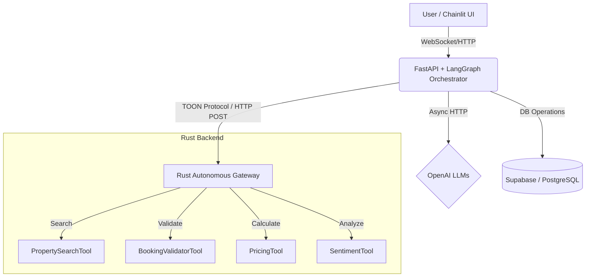
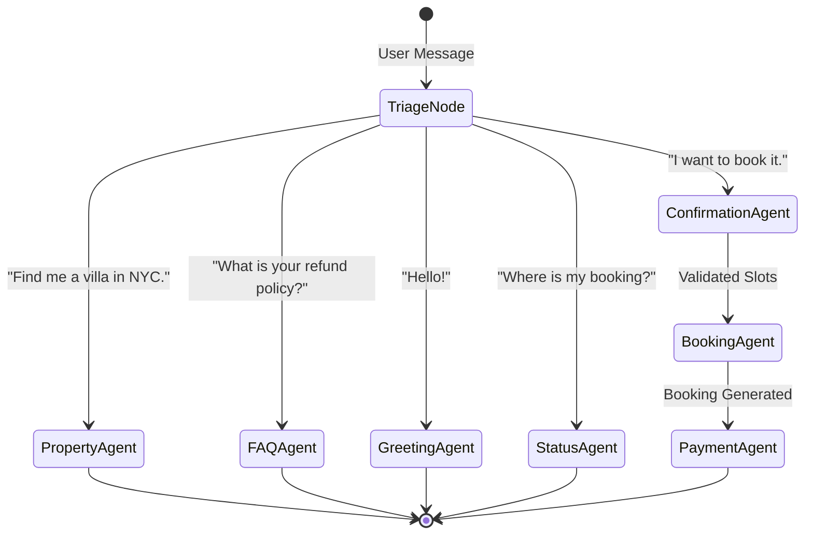

# 🏨 AI Concierge: Hybrid Python + Rust Real Estate Platform

[](https://www.python.org/)
[](https://www.rust-lang.org/)
[](https://fastapi.tiangolo.com/)
[](https://python.langchain.com/docs/langgraph)
[](https://supabase.com/)
[](https://openai.com/)
[](https://github.com/tokio-rs/axum)

> A production-grade, highly advanced AI hotel and real estate booking platform featuring a Chainlit conversational UI, dynamic LangGraph state routing, and high-throughput Rust microservices.

---

## 📖 Project Overview

The **AI Concierge** represents the next generation of conversational AI platforms for the hospitality and real estate industry. It provides a seamless, ChatGPT-like interface where users can search for properties, ask complex FAQ questions, validate booking parameters, and calculate pricing—all driven by dynamic NLP and agentic reasoning.

Instead of relying on brittle regex or slow single-threaded python loops, this project leverages a **Hybrid Architecture**: passing stateful, non-deterministic reasoning through LLMs and LangGraph in Python, while offloading intense deterministic computation gracefully to blazing-fast Rust microservices.

---

## ⚡ Why a Hybrid Architecture?

In building agentic AI workflows, one persistent challenge is the event loop: LLM and NLP inference takes time, and heavily nested array searches or validations can block asynchronous servers (like FastAPI). 

Our design philosophy bridges the best of both worlds:
1. **Python (Reasoning & Orchestration):** Handles the non-deterministic conversational flow, memory instantiation (LangGraph), and semantic NLP heuristics (spaCy, VADER, sentence-transformers). 
2. **Rust (Deterministic Compute):** Acts as a high-throughput computational engine via Axum/Tokio. When the Python agents need to filter thousands of properties, perform complex date mathematics, validate bookings, or run secondary fraud checks, they offload this payload to the Rust Gateway so the Python async loop never blocks.

---

## 🏗️ System Architecture

The overarching system involves a user talking to the Chainlit frontend, which communicates with the FastAPI/LangGraph orchestrator. This orchestrator then distributes heavy computation to either OpenAI, Supabase, or the Rust Gateway.



---

## 🤖 Agent Workflow

The core state machine is managed by LangGraph. When a message arrives, the `triage` node utilizes embedding-based similarity and semantic NER to instantly route the user to the correct sub-agent.



---

## 🦀 The Rust Autonomous Gateway

The Rust backend is built on **Axum + Tokio** to provide extreme concurrency. It isn't just a static REST API; it operates an `/execute` endpoint serving as a **schema-agnostic tool registry**. 

When Python sends a payload to `/execute`, the Rust Gateway actively scores the payload keys (using an inference algorithm) to detect the exact intent—be it `Search`, `Booking`, or `FraudCheck`—and routes the calculation to the correct compiled tool. Fast, memory-safe, and infinitely scalable.

---

## 📜 The TOON Protocol

To optimize the bandwidth and serialization overhead between the Python Orchestrator and the Rust Gateway natively, the system utilizes **TOON** *(Token-Optimized Object Notation)*. 

Instead of traditional JSON, TOON is an ultra-lightweight, indentation-based format with header-based arrays. It is implicitly optimized for LLM contexts and dramatically reduces the syntax footprint required for microservice-to-microservice communication. Both Python and Rust boast custom serializers specifically for building and decoding this format.

---

## 🧠 The Soft-Coded NLP Engine

Gone are the days of brittle hardcoded regex matches. The `services/nlp_engine.py` operates a complete suite of NLP inferences wrapping `spaCy` (NER), `VADER` (sentiment analysis), and `sentence-transformers` (zero-shot intent classification). 

Furthermore, memory safety is ensured. Every heavyweight NLP call uses `asyncio.to_thread` behind the scenes, ensuring the FastAPI event loop stays fully responsive to concurrently operating clients while evaluating vectors.

---

## 🚀 Getting Started / Installation Guide

We recommend running the architecture side-by-side using two terminal windows.

### Prerequisites
- **Python 3.12+**
- **Rust Toolchain** (`cargo`, `rustc`)
- **Supabase Account** (PostgreSQL)

### 1. Setup Python Orchestrator & UI

```bash
# Clone the repository
git clone https://github.com/muhammadhasaan82/Hotel_Booking.git
cd Hotel_Booking

# Create and activate a Virtual Environment
python -m venv venv
source venv/bin/activate  # On Windows: .\venv\Scripts\activate

# Install dependencies
pip install -r requirements.txt

# Download required spaCy models
python -m spacy download en_core_web_sm

# Configure environment variables
cp services/env.example .env
# Important: Add your OPENAI_API_KEY and SUPABASE_DB_URL to the .env file!
```

### 2. Setup the Rust Backend

Open a second terminal window:

```bash
cd Hotel_Booking/rust_gateway

# Build and run the Axum server
cargo run --release
```
*The Rust Gateway will now listen securely on `http://localhost:3001`.*

### 3. Run the Conversational UI

Back in your Python terminal environment, ignite the Chainlit frontend:

```bash
chainlit run chainlit_app.py -w
```
*The dashboard will automatically open in your browser at `http://localhost:8000`.*

---

## 📁 Folder Structure

```text
Hotel_Booking/
├── chainlit_app.py         # The Conversational UI Bridge
├── requirements.txt        # Python dependency manifest
├── services/               # 🐍 Python State & Orchestration
│   ├── agents.py           # LangGraph Agent implementations
│   ├── graph.py            # LangGraph explicit routing logic
│   ├── nlp_engine.py       # Async spaCy/VADER NLP wrapper
│   ├── rust_client.py      # TOON-powered async client
│   └── toon.py             # Custom TOON Python encoder/decoder
├── rust_gateway/           # 🦀 Rust Deterministic Microservice
│   ├── src/
│   │   ├── main.rs         # Axum Server & HTTP middleware
│   │   ├── gateway.rs      # Autonomous intent inference
│   │   ├── toon.rs         # Native Rust TOON serialization
│   │   └── tools/          # Discrete compiled Tool objects
│   └── Cargo.toml          # Rust package manifest
└── route/                  # FastAPI sub-routing
```