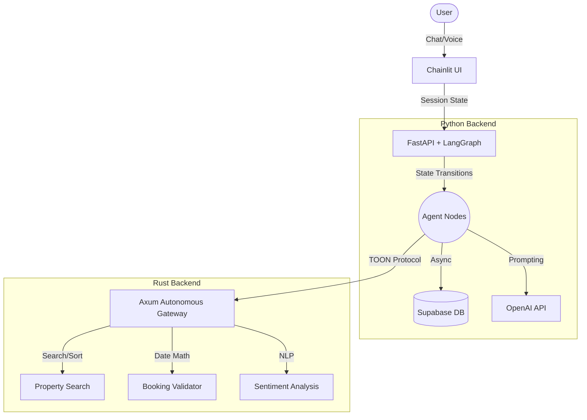
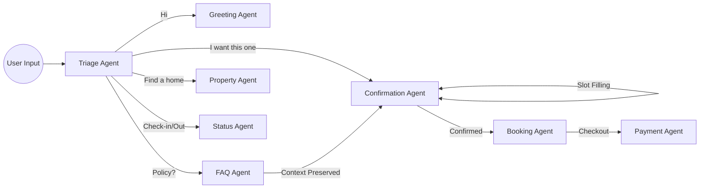

# 🏨 AI Concierge: Hybrid Python + Rust Real Estate Platform

[](https://www.python.org/)
[](https://www.rust-lang.org/)
[](https://fastapi.tiangolo.com/)
[](https://python.langchain.com/docs/langgraph)
[](https://supabase.com/)
[](https://openai.com/)
[](https://github.com/tokio-rs/axum)

> A production-grade, highly advanced AI hotel and real estate booking platform featuring a Chainlit conversational UI, dynamic LangGraph state routing, and high-throughput Rust microservices.

---

## 📖 Project Overview

The **AI Concierge** represents the next generation of conversational AI platforms for the hospitality and real estate industry. It provides a seamless, ChatGPT-like interface where users can search for properties, ask complex FAQ questions, manage bookings, and check their booking status. 

Behind the scenes, the system utilizes a cutting-edge hybrid architecture that separates non-deterministic AI reasoning from heavy, deterministic computational tasks.

---

## 🏗️ Why a Hybrid Architecture?

Modern AI agents often suffer from event-loop blocking when handling heavy computations or string parsing in Python. We solved this by splitting the responsibilities:

1. **Python (Reasoning & Orchestration):** Manages the conversational state, LangGraph multi-agent routing, and OpenAI interactions.
2. **Rust (Deterministic Compute):** A high-speed Axum microservice that acts as an autonomous tool gateway. It handles property filtering, pricing math, booking date validation, and sentiment analysis. 

This guarantees that our asynchronous Python web server remains lightning-fast and never freezes under heavy load.

---

## 🗺️ System Architecture



## 🤖 Agent Workflow (LangGraph)
Our agentic framework uses a robust state machine to preserve context. If a user asks an FAQ question in the middle of a booking, the system safely routes them to the FAQ agent and seamlessly brings them back to complete their booking.



## ⚙️ Core Technical Innovations

### 1. The Rust Autonomous Gateway
The Rust microservice (`/execute` endpoint) does not rely on strict JSON schemas. It accepts arbitrary payloads and uses heuristic scoring to infer the Python agent's intent. It dynamically routes the data to specific internal Rust tools (Search, Validation, Pricing) and returns a structured response.

### 2. The TOON Protocol
To minimize LLM hallucination and payload overhead, Python and Rust communicate using a custom serialization format called **TOON** *(Token-Optimized Object Notation)*. It utilizes strict indentation rules and eliminates redundant brackets and quotes, highly optimizing the data pipeline between the two languages.

### 3. Soft-Coded NLP Engine
We stripped out all brittle Regex and hardcoded dictionaries. The Python `nlp_engine.py` uses:
- **spaCy (NER):** Dynamically extracts Names, Dates, Cities, and Entities.
- **VADER Sentiment:** Evaluates user affirmations ("yes", "yup", "sure") and negations dynamically.
- **Sentence-Transformers:** Performs zero-shot intent classification via cosine similarity.

*(All heavy NLP calls are wrapped in `asyncio.to_thread` to preserve FastAPI's concurrency).*

---

## 🚀 Getting Started

### Prerequisites
- **Python 3.12+**
- **Rust & Cargo** (rustup default stable)
- **uv** (Ultra-fast Python package installer: `curl -LsSf https://astral.sh/uv/install.sh | sh`)
- **Supabase CLI** (For local database)

### 1. Python Environment Setup
We use `uv` for lightning-fast dependency resolution and virtual environments.

```bash
# Clone the repository
git clone https://github.com/muhammadhasaan82/Hotel_Booking.git
cd Hotel_Booking

# Create and activate a virtual environment with uv
uv venv
source .venv/bin/activate  # On Windows: .venv\Scripts\activate

# Install dependencies
uv pip install -r requirements.txt

# Download the spaCy English model
uv run python -m spacy download en_core_web_sm

# Setup your environment variables
cp services/env.example .env
# Edit .env and add your OPENAI_API_KEY
```

### 2. Rust Gateway Setup
Open a second terminal window to run the high-performance computational backend:

```bash
cd Hotel_Booking/rust_gateway

# Build and run the Axum server
cargo run --release
```
*The Rust Gateway will now listen securely on `http://localhost:3001`.*

### 3. Run the Conversational UI
Back in your Python terminal environment, ignite the Chainlit frontend:

```bash
# Start the Chainlit UI with hot-reloading
uv run chainlit run chainlit_app.py -w
```
*The dashboard will automatically open in your browser at `http://localhost:8000`.*

---

## 📁 Folder Structure

```text
Hotel_Booking/
├── chainlit_app.py         # The Conversational UI Bridge
├── requirements.txt        # Python dependency manifest
├── services/               # 🐍 Python State & Orchestration
│   ├── agents.py           # LangGraph Agent implementations
│   ├── graph.py            # LangGraph explicit routing logic
│   ├── nlp_engine.py       # Async spaCy/VADER NLP wrapper
│   ├── rust_client.py      # TOON-powered async client
│   └── toon.py             # Custom TOON Python encoder/decoder
├── rust_gateway/           # 🦀 Rust Deterministic Microservice
│   ├── src/
│   │   ├── main.rs         # Axum Server & HTTP middleware
│   │   ├── gateway.rs      # Autonomous intent inference
│   │   ├── cache.rs        # High-speed LRU Cache
│   │   ├── toon.rs         # Rust TOON encoder/decoder
│   │   └── tools/          # Rust Computational Tools (Search, Validations)
├── route/                  # FastAPI REST endpoints
└── supabase/               # Local database schemas and migrations
```