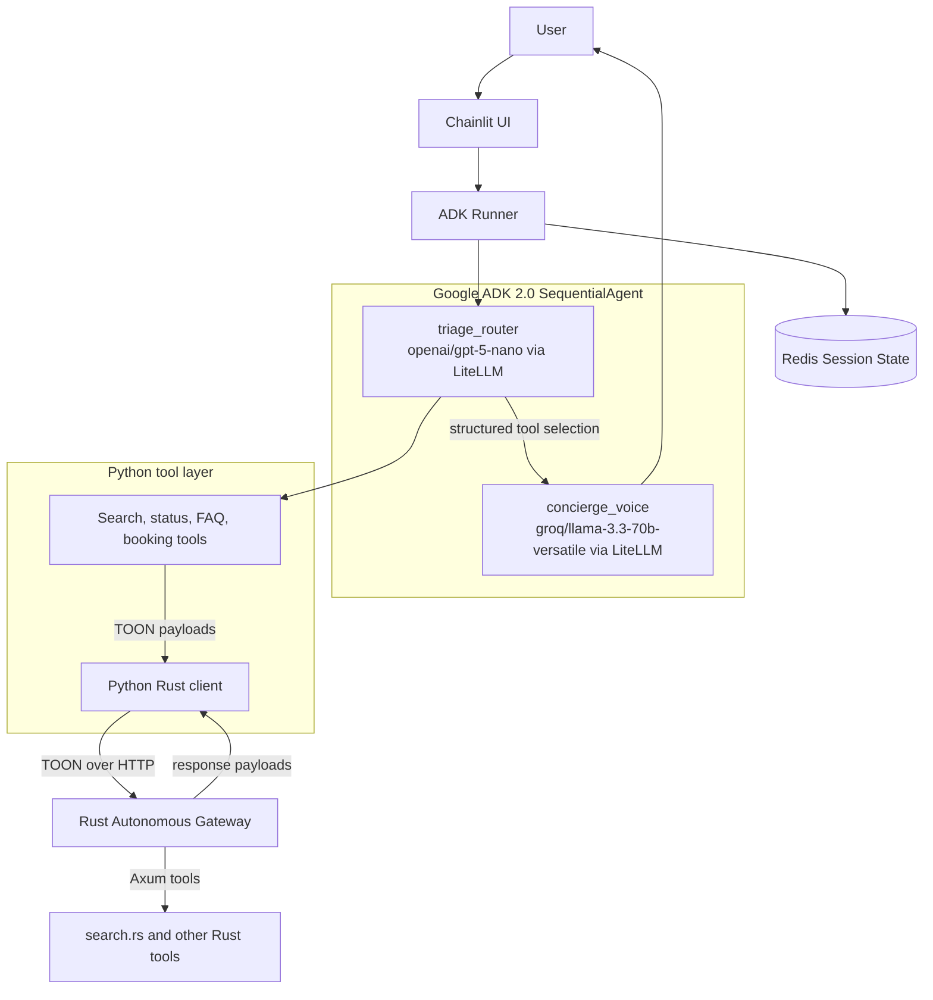
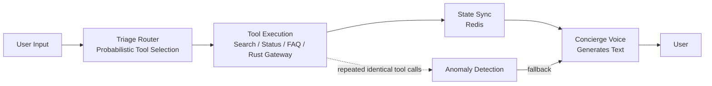

# AI Property Booking Concierge V2

AI Property Booking Concierge V2 is a hybrid Python/Rust booking concierge for property discovery, shortlist selection, booking capture, FAQ handling, and reservation status checks. The V2 rewrite removes LangGraph and uses a pure Google ADK 2.0 SequentialAgent pipeline. Python is kept as wiring only; policy lives in [backend/app/config/agent_config.yaml](backend/app/config/agent_config.yaml), prompts live in [backend/app/prompts/triage_instruction.md](backend/app/prompts/triage_instruction.md) and [backend/app/prompts/voice_instruction.md](backend/app/prompts/voice_instruction.md), and the agent graph is assembled in [backend/app/agents/adk_agents.py](backend/app/agents/adk_agents.py).

## Description

The system keeps the conversational loop small and explicit. The triage node decides what should happen next, the tool layer fetches or mutates state, and the voice node turns structured output into user-facing text. The repository follows a super soft coded approach: Python wires behavior, YAML owns policy, and Markdown owns prompts.

## Architecture

The V2 pipeline has two LLM nodes. triage_router uses openai/gpt-5-nano through LiteLLM as a probabilistic state router, and it never generates conversational text. concierge_voice uses groq/llama-3.3-70b-versatile through LiteLLM to turn tool payloads into human-readable replies.

Redis-backed session state lives in [backend/app/services/redis_store.py](backend/app/services/redis_store.py) and is orchestrated by [backend/app/services/adk_runner.py](backend/app/services/adk_runner.py). Python calls the Rust gateway through TOON, implemented in [backend/app/services/toon.py](backend/app/services/toon.py) and [backend/rust_gateway/src/toon.rs](backend/rust_gateway/src/toon.rs).



## Workflow

A user message enters [frontend/chainlit_app.py](frontend/chainlit_app.py). The UI pins thread_id to ADK session_id, which keeps the session stable across refreshes and process restarts as long as the conversation thread is reused. The runner loads the current session snapshot, routes the request, records tool calls, and writes the updated state back to Redis.

Search results use deterministic state memory on top of probabilistic routing. When [backend/app/agents/tools/search.py](backend/app/agents/tools/search.py) returns a shortlist, it stores active_property_options_map in soft state so a later request like Option 15 can be resolved to the exact property UUID without guessing. The router can infer intent loosely, but the backend maps the selection deterministically.

Anomaly protection in [backend/app/security/anomaly.py](backend/app/security/anomaly.py) watches for repeated identical tool calls inside a time window. If the router starts looping, the system raises a [ROUTING_ANOMALY] condition and degrades gracefully. Normal repeatable tools such as handle_small_talk are exempt through [backend/app/config/agent_config.yaml](backend/app/config/agent_config.yaml).



## Interesting Techniques

- Token-safe Summary Mode: [backend/app/agents/tools/search.py](backend/app/agents/tools/search.py) and [backend/rust_gateway/src/tools/search.rs](backend/rust_gateway/src/tools/search.rs) remove heavy fields such as descriptions and amenities once the result count crosses summary_mode_threshold, so large searches stay under Groq's token budget without capping the search space.
- Context-aware anomaly loop detection: [backend/app/security/anomaly.py](backend/app/security/anomaly.py) hashes tool parameters, counts repeated invocations in a sliding window, and blocks tool-loop hijacking while still allowing configured exceptions from [backend/app/config/agent_config.yaml](backend/app/config/agent_config.yaml).
- Pinned session state bridging: the browser transport behaves like a long-lived [WebSockets API](https://developer.mozilla.org/en-US/docs/Web/API/WebSockets_API) or [Server-sent events](https://developer.mozilla.org/en-US/docs/Web/API/Server-sent_events) session, but the canonical conversation state lives in Redis and is keyed by the ADK session_id.
- Dual-model separation of concerns: triage_router decides what to do, and concierge_voice decides how to say it. That split keeps routing narrow and response style independent.

## Non-Obvious Technologies

- google.adk provides the SequentialAgent runtime, session service interface, and event loop for tool calling.
- LiteLLM normalizes provider access for both OpenAI and Groq so the agent wiring does not depend on a single model vendor.
- Chainlit powers the chat UI in [frontend/chainlit_app.py](frontend/chainlit_app.py) and keeps the browser conversation aligned with backend session state.
- Axum serves the Rust gateway in [backend/rust_gateway/src/main.rs](backend/rust_gateway/src/main.rs) and handles the tool boundary.
- ChromaDB backs the retrieval layer used by FAQ and semantic search code in [backend/app/components/retrieval.py](backend/app/components/retrieval.py).
- TOON, short for Token-Optimized Object Notation, is the compact line-oriented format used between Python and Rust in [backend/app/services/toon.py](backend/app/services/toon.py) and [backend/rust_gateway/src/toon.rs](backend/rust_gateway/src/toon.rs).

## Project Structure

```text
backend/
    app/
        agents/
            adk_agents.py
            tools/
        config/
            agent_config.yaml
            agent_config_loader.py
        security/
            anomaly.py
            guardrails.py
        services/
            adk_runner.py
            redis_store.py
        prompts/
            triage_instruction.md
            voice_instruction.md
    rust_gateway/
        src/
            main.rs
            gateway.rs
            tools/
                search.rs
frontend/
    chainlit_app.py
```

[backend/app/agents/](backend/app/agents/) wires the ADK nodes and keeps tool logic split across search, booking, and support modules.
[backend/app/config/](backend/app/config/) is the single source of truth for models, thresholds, messages, and intent sets.
[backend/app/security/](backend/app/security/) contains the anomaly guard and request guardrails.
[backend/app/services/](backend/app/services/) manages ADK execution, Redis persistence, and the TOON bridge.
[backend/rust_gateway/src/](backend/rust_gateway/src/) is the Axum service boundary and Rust tool layer.
[frontend/](frontend/) is the Chainlit UI and session bridge.
