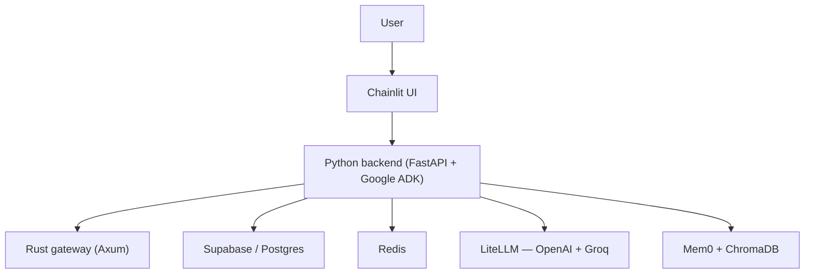
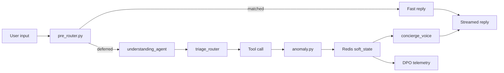

# AI Property Booking Concierge V2.5

## Description

AI Property Booking Concierge V2.5 is a hybrid Python and Rust booking concierge for property search, FAQ lookup, booking capture, reservation follow-up, and support handoff. The system uses a Google ADK 2.0 `SequentialAgent` pipeline, a deterministic pre-router for fast-path intents, a soft-coded tool registry, Redis-backed session state, and a Rust gateway for low-latency FAQ and tool execution paths.

The project is designed around one principle: agent behavior should be configurable, observable, and easy to evolve without hardcoding large amounts of routing logic in Python. Thresholds, intents, prompts, tool metadata, response styles, booking fields, fallback copy, and routing policies live under `backend/app/config/` and `backend/app/prompts/`.

## Architecture


```mermaid
flowchart TD
    U["User"] --> CL["Chainlit UI"]
    CL --> PY["Python backend (FastAPI + Google ADK)"]
    PY --> RS["Rust gateway (Axum)"]
    PY --> DB["Supabase / Postgres"]
    PY --> RD["Redis"]
    PY --> LLM["LiteLLM — OpenAI + Groq"]
    PY --> MEM["Mem0 + ChromaDB"]
```

The user talks to Chainlit. The FastAPI backend runs the ADK pipeline and delegates hot paths to the Rust gateway. Supabase/Postgres stores thread history and operational records, Redis stores ADK session snapshots and anomaly counters, Mem0 stores durable user context, and LiteLLM fronts the configured LLM providers.

## Agent Pipeline

V2.5 runs a three-node ADK `SequentialAgent` defined in `backend/app/agents/adk_agents.py`.

| Node | Role | Typical model | Output |
|------|------|---------------|--------|
| `understanding_agent` | Classifies intent, entities, mood, and constraints | Dispatcher model | Typed `UnderstandingFrame` JSON |
| `triage_router` | Selects exactly one tool or route | Dispatcher model | `router_output` with tool call |
| `concierge_voice` | Writes the final user-facing response | Voice model | Streamed markdown text |

Before ADK runs, `backend/app/services/pre_router.py` handles deterministic detection for greetings, thanks, goodbye, acknowledgements, and out-of-scope queries. When a fast-path match is found, a lightweight model can generate the reply and the full ADK pipeline is skipped for that turn.


```mermaid
flowchart LR
    IN["User input"] --> PR["pre_router.py"]
    PR -->|matched| FAST["Fast reply"]
    PR -->|deferred| UA["understanding_agent"]
    UA --> TR["triage_router"]
    TR --> TOOL["Tool call"]
    TOOL --> AD["anomaly.py"]
    AD --> STATE["Redis soft_state"]
    STATE --> CV["concierge_voice"]
    CV --> OUT["Streamed reply"]
    FAST --> OUT
    STATE --> TEL["DPO telemetry"]
```

## Tool Registry

Tools are declared in `backend/app/config/tool_registry.yaml` and loaded by `backend/app/config/tool_registry_loader.py`. Adding a tool requires implementing the Python function under `backend/app/agents/tools/` and adding one YAML block. The agent definition does not need to be edited for every tool change.

| Tool | Module | Role |
|------|--------|------|
| `search_properties` | `backend/app/agents/tools/search.py` | Property search through Rust gateway with Python fallback |
| `get_property_details` | `backend/app/agents/tools/search.py` | Full details for a selected property |
| `select_property` | `backend/app/agents/tools/search.py` | Resolve user selections against the active shortlist |
| `get_all_available_cities` | `backend/app/agents/tools/search.py` | Available city discovery |
| `check_faq` | `backend/app/agents/tools/support.py` | Policy lookup through Rust CAG and RAG fallback |
| `check_booking_status` | `backend/app/agents/tools/support.py` | Booking status lookup |
| `handle_small_talk` | `backend/app/agents/tools/support.py` | Greetings, thanks, and scope redirects |
| `escalate_to_human` | `backend/app/agents/tools/support.py` | Human support handoff |
| `request_booking_details` | `backend/app/agents/tools/booking.py` | Collect missing booking fields |
| `review_booking_details` | `backend/app/agents/tools/booking.py` | Show booking summary before confirmation |
| `process_v2_booking` | `backend/app/agents/tools/booking.py` | Finalize and persist booking |

## State Layers

- **Durable user memory**: `backend/app/services/memory_engine.py` uses local Mem0 with ChromaDB for long-lived user preferences.
- **Session state**: `backend/app/services/adk_runner.py` and `backend/app/services/redis_store.py` keep ADK events and `soft_state` in Redis snapshots.
- **Thread state**: `frontend/chainlit_app.py` maps Chainlit `thread_id` to the ADK `session_id` and persists thread data through Chainlit's data layer.

## Rust Gateway

The Rust service in `backend/rust_gateway/` uses Axum and provides:

- Cache-augmented FAQ matching in `backend/rust_gateway/src/cag.rs`.
- Tool dispatch in `backend/rust_gateway/src/gateway.rs`.
- Sliding-window rate limiting in `backend/rust_gateway/src/rate_limiter.rs`.
- TOON serialization in `backend/rust_gateway/src/toon.rs`, mirrored by `backend/app/services/toon.py`.

## Key Techniques

- Probabilistic LLM routing with deterministic state resolution.
- Deterministic pre-routing for low-value turns and out-of-scope messages.
- Typed LLM output through a Pydantic `UnderstandingFrame` contract.
- YAML-driven tool registry, policies, prompts, fallback copy, and thresholds.
- Shadow-mode policy routing before enforcement.
- Redis-backed session snapshots for reconnects and hot reloads.
- Rust FAQ and tool gateway for latency-sensitive execution paths.
- DPO telemetry export for later dispatcher fine-tuning.

## Environment Flags

The template in `env.example` lists the full environment configuration. Important flags include:

| Variable | Purpose |
|----------|---------|
| `ADK_DISPATCHER_MODEL` | Model for understanding and triage nodes |
| `ADK_VOICE_MODEL` | Model for final user-facing responses |
| `PRE_ROUTER_FAST_MODEL` | Fast model for pre-router replies |
| `UNDERSTANDING_FRAME_ENABLED` | Toggle the three-node pipeline |
| `TOOL_REGISTRY_ENABLED` | Load tools from YAML registry |
| `RESPONSE_POLICIES_ENABLED` | Inject response-policy snippets into voice prompt |
| `POLICY_ROUTER_MODE` | `off`, `shadow`, or `enforce` |
| `ANOMALY_TOOL_LOOP_THRESHOLD` | Repeated identical tool calls before anomaly detection |
| `ANOMALY_TIME_WINDOW_SECONDS` | Sliding window for anomaly detection |
| `DPO_TELEMETRY_ENABLED` | Enable trajectory logging for DPO export |
| `RUST_RATE_LIMIT_MAX` | Max Rust gateway requests per IP per window |
| `RUST_RATE_LIMIT_WINDOW_SECS` | Rust gateway rate-limit window |
| `REDIS_URL` | Redis connection string |
| `MEM0_ENABLED` | Toggle durable memory |

## Project Structure

```text
Hotel-booking/
├── backend/
│   ├── app/
│   │   ├── agents/
│   │   ├── components/
│   │   ├── config/
│   │   ├── observability/
│   │   ├── prompts/
│   │   ├── route/
│   │   ├── security/
│   │   └── services/
│   ├── data/
│   ├── evaluation/
│   ├── infrastructure/
│   ├── rust_gateway/
│   ├── scripts/
│   └── tests/
├── docs/
├── frontend/
│   └── public/
├── .github/
│   └── workflows/
└── .chainlit/
```

## Documentation

- `docs/architecture.md` — system architecture and design notes.
- `docs/api-reference.md` — API reference.
- `docs/deployment.md` — deployment notes.
- `docs/finetuning_playbook.md` — fine-tuning and DPO workflow notes.

## License and Attribution

Released under the [MIT License](LICENSE). Copyright (c) 2026 Muhammad Hasaan.

This means you may use, copy, modify, merge, publish, distribute, sublicense, and sell copies of this project, subject to the MIT License terms. The license requires that the copyright notice and permission notice remain included in all copies or substantial portions of the software.

If you use this project, fork it, publish a derivative, include it in a demo, or reference it in a portfolio/research/project submission, please give visible credit to the original author:

> Original project by Muhammad Hasaan — AI Property Booking Concierge

Suggested attribution format:

```text
Based on AI Property Booking Concierge by Muhammad Hasaan, licensed under the MIT License.
```

This attribution request is intended to make the original work clear while preserving the standard MIT License permissions.
