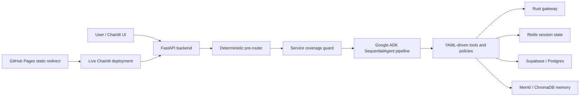

# AI Property Booking Concierge

AI Property Booking Concierge is a FastAPI-backed booking assistant for property search, policy Q&A, booking review, and booking confirmation flows. The backend uses a Google ADK `SequentialAgent` pipeline with deterministic pre-routing and service coverage guards, a Chainlit UI, Redis-backed session state, Supabase/Postgres persistence, Mem0/ChromaDB durable memory, and a Rust gateway for selected deterministic routing/search support.

The project is intentionally configuration-driven: tools, prompts, booking schema, routing policies, response policies, property filters, service coverage, guardrails, retrieval, and thresholds are defined in YAML under `app/config/`.

## Current Status

- Main booking flow is covered by senior live smoke testing.
- Supported city and property search flow works.
- Policy FAQ interruption during booking works.
- Refund policy interruption and booking resume work.
- Booking details extraction, review, and amendment flow work.
- Unsupported non-US city handling works.
- Unsupported-city `YES` flow now lists available cities, asks for the city, then lists property types only.
- Unsupported-city `NO` flow politely exits.
- Senior live smoke currently passes with `SMOKE_EXIT=0`.

## Architecture



## Booking Flow

The core booking path is:

1. The greeting asks for a city or destination.
2. The user can ask policy or FAQ questions before or during booking.
3. Property search supports city and property type constraints.
4. The user selects a property by option number.
5. The user confirms intent to book the selected property.
6. The system asks for full name, email, phone number, check-in date, check-out date, and number of guests.
7. The system calculates nights and total price.
8. The system presents a booking review before final confirmation.
9. The user can amend entered fields such as email or check-out date.
10. The system regenerates an updated booking review after amendments.

Booking field order and validation are configured in `app/config/booking_schema.yaml`.

## Policy FAQ Interruption

Users can ask policy questions during booking without losing the in-progress booking state. For example:

```text
what is the refund policy? if i refund under 5 days before check-in date?
```

The system answers the policy question and then asks whether the user wants to continue booking. Booking state is preserved and the flow resumes from the previous booking stage when the user continues.

## Service Coverage / Unsupported City Recovery

Service coverage is configured in `app/config/service_coverage.yaml`. The current supported country is the United States, and unsupported non-US regions are intercepted before the ADK/property-search path.

Unsupported city example:

```text
User: i am looking for condo in Lahore
System: This service is currently available for the United States only and asks whether to list supported cities.
```

If the user says `yes`:

- The system lists available city names only.
- The system asks which city the user wants to book with.

If the user chooses a supported city:

- The system lists property type names only for that city.
- It must not show prices or full property cards at this step.
- Example property types include Apartment, Bungalow, Condo, Cottage, Duplex, House, Loft, Studio, Townhouse, and Villa.

If the user then chooses a property type, the system lists matching properties for that city and property type.

If the user says `no`, the system politely exits, for example:

```text
Okay, bye. See you soon.
```

This behavior is covered by `tests/tests/test_service_coverage_guard.py`, including unsupported city rejection, `YES` city-list follow-up, supported city selection returning property types only, property type selection returning matching listings, and the `NO` exit path.

## Deployment / Frontend Access

GitHub Pages is used for static hosting only. It cannot run the Python/FastAPI/Chainlit app directly.

The repository uses `frontend_static/index.html` as a redirect page to the live Chainlit deployment. The redirect uses both a meta refresh tag and JavaScript `window.location.replace(...)`. The live app is served separately by the backend/Chainlit deployment.

GitHub Pages redirects users to the app; it does not proxy the app.

## CI/CD Summary

### CI workflow

File: `.github/workflows/ci.yml`

Triggers:

- Push to `main`
- Push to `dev`
- Pull requests into `main` or `dev`
- Manual `workflow_dispatch`

Jobs:

1. Workflow YAML lint

- Checks workflow YAML syntax using Python/PyYAML.

2. Backend tests and evals

- Uses Python 3.12.
- Installs dependencies with `uv`.
- Compiles Python files with `py_compile`.
- Checks app file sizes with `scripts/check_app_file_sizes.py`.
- Runs focused regression tests.
- Runs the evaluation report card with `evaluation/v2_eval.py`.
- Uses `--fail-under 0.85`.
- Uploads eval artifacts from `backend/evaluation/eval_results/`.

3. Rust gateway

- Installs stable Rust with `rustfmt`.
- Runs `cargo fmt --check`.
- Runs `cargo check`.
- Runs `cargo test`.

### GitHub Pages workflow

File: `.github/workflows/pages.yml`

Triggers:

- Push to `main`
- Manual `workflow_dispatch`

Permissions:

- `contents: read`
- `pages: write`
- `id-token: write`

The workflow builds `_site` from `frontend_static`, generates `_site/config.js` from `PUBLIC_API_BASE_URL`, uploads the Pages artifact, and deploys to GitHub Pages. The current static frontend redirects to the live Chainlit app login.

## Testing

Safe focused checks from the repository root or backend directory:

```bash
cd backend
uv run env PYTHONPATH=. python -m py_compile $(find app evaluation tests -name "*.py" -not -path "*/__pycache__/*")
uv run python scripts/check_app_file_sizes.py
uv run env PYTHONPATH=. pytest -v --tb=short tests/tests/test_service_coverage_guard.py
uv run env PYTHONPATH=. python evaluation/v2_eval.py --dataset evaluation/golden_set.yaml --json --out evaluation/eval_results/latest.json --ci --fail-under 0.85
```

The senior live smoke test is an external/manual API-level smoke procedure. It should not be run automatically inside CI unless intentionally added later, because it starts a live server and can produce long output.

## Recent Reliability Fixes

- Fixed unsupported-city recovery state handling.
- Added regression coverage for unsupported city rejection.
- Added regression coverage for `YES` city-list follow-up.
- Added regression coverage for supported city selection returning property types only.
- Added regression coverage for property type selection returning matching city/property listings.
- Added regression coverage for the `NO` exit path.
- Verified by senior live smoke with `SMOKE_EXIT=0`.

## Project Structure

```text
AI_Property_Booking_concierge/
├── .github/workflows/
│   ├── ci.yml
│   └── pages.yml
├── frontend_static/
│   ├── index.html
│   ├── app.js
│   ├── config.js
│   └── styles.css
├── docker-compose.yml
└── backend/
    ├── app/
    │   ├── agents/
    │   ├── components/
    │   ├── config/
    │   ├── route/
    │   ├── security/
    │   └── services/
    ├── data/
    ├── evaluation/
    ├── infrastructure/
    ├── rust_gateway/
    ├── scripts/
    ├── tests/
    ├── Dockerfile
    ├── pyproject.toml
    └── requirements.txt
```

## Run Locally

From the repository root:

```bash
docker compose up redis -d
cd backend
uvicorn app.main:app --reload --port 8000
```

The Chainlit UI and production deployment wiring are separate from GitHub Pages. GitHub Pages only redirects to the live Chainlit app.
